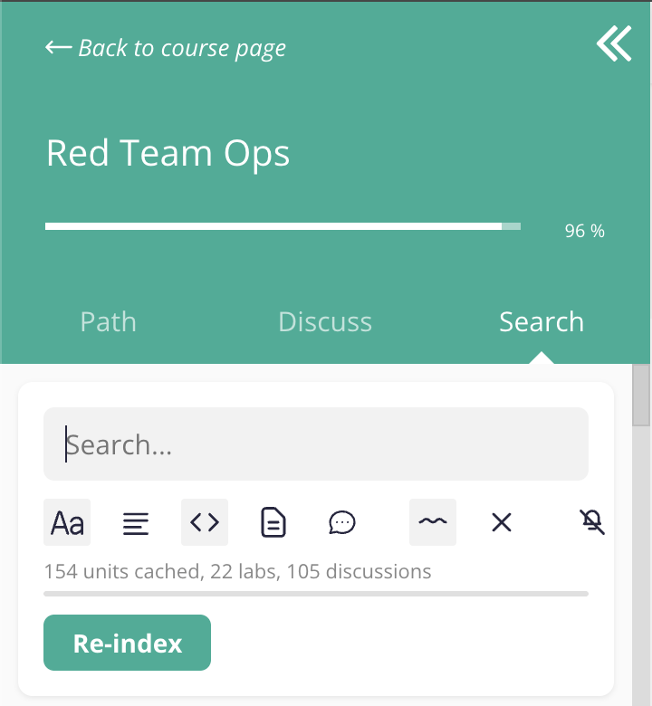
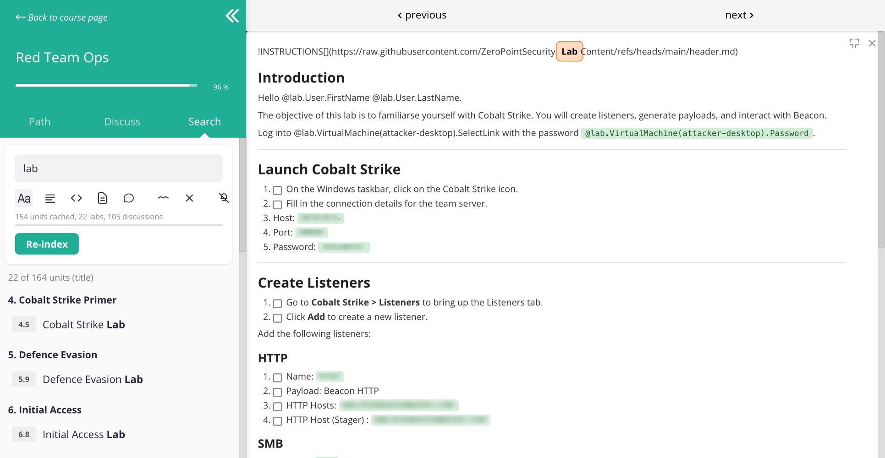
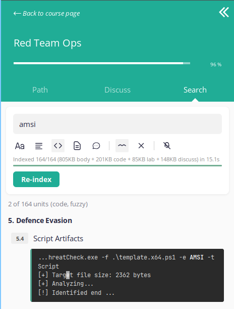

# ZPS Course Search

Tampermonkey userscript that adds full-text search to Zero Point Security course players.

The LearnWorlds platform used by Zero Point Security ships no in-course search. Finding a specific command, technique, or concept means manually clicking through modules one by one. Lab instructions are locked behind SCORM iframes and not searchable at all. This script injects a Search tab next to Path and Discuss in the course player sidebar and indexes every unit, making any keyword or phrase findable across the whole course from one place.

The course material is a valuable reference during real engagements, but looking up a specific technique or code snippet across dozens of modules is impractical without search. This tool makes the course material usable as a day-to-day reference, not just a learning path.

## Features

### Scope toggles

Each scope can be toggled independently via the toolbar. Only enabled scopes are searched and indexed.

| Icon | Scope | Description | Default |
|------|-------|-------------|---------|
|  | Title | Unit titles and section headings. | On |
|  | Body text | Ebook prose and paragraph content. | Off |
|  | Code | Code blocks and inline code. | Off |
|  | Labs | Lab markdown files fetched via the attachment-unlock API. | Off |
|  | Discussions | Student and staff comments from the Discuss tab. | Off |

### Search modes

| Mode | How to use | Description |
|------|-----------|-------------|
| Exact | Type normally | Matches the exact phrase, flexible on whitespace and special characters. |
| Fuzzy | Prefix with `~` | Matches words in any order within a paragraph. Tolerates curly quotes, en-dashes, non-breaking spaces, and zero-width characters injected by the LearnWorlds renderer. |

### Additional toolbar controls

| Icon | Name | Description |
|------|------|-------------|
|  | Fuzzy toggle | Switch between exact and fuzzy search mode. |
|  | Clear | Clear the search query and results. |
|  | Suppress prompts | Silences the "Leave site?" beforeunload dialog when navigating between lab units. Recommended on for speed-skimming, off when solving labs. |

### Other features

- Multi-hit highlighting: long bodies, code blocks, and discussions emit one result row per occurrence with separate navigation between matches
- Clicking a discuss result switches to the Discuss tab, expands collapsed reply threads, and highlights the matching comment
- Lab markdown rendered inline with a preview panel. Lab content is normally only visible after launching a lab

- Per-course cache keyed by the courseid query parameter. Course switching does not require re-indexing
- Active selection indicator on clicked search results

## Compatibility

Tested on Chrome with Tampermonkey, but should work in Firefox too.

## Privacy

The script only reads course content that is already accessible to enrolled students. It does not modify any data, send external requests, or interact with anything beyond the course player DOM.

## Installation

1. Install [Tampermonkey](https://www.tampermonkey.net/) (Chrome/Edge/Firefox)
2. Open `course-search.user.js` in this repository and click "Raw" to trigger the extension install prompt
3. Confirm the installation in the extension dialog

## Usage

1. Open any Zero Point Security course player page
2. Click the "Search" tab in the left sidebar
3. Click "Index" once to build the search cache
4. Search for any keyword, command, or phrase

Results are grouped by module and unit. Click any result to navigate to that unit with the match highlighted. Use the scope toggles to filter by content type.

## Indexing

Indexing runs in three phases: ebook and code content first, then lab markdown, then discussion comments. Each phase uses a configurable number of concurrent workers (default 4) with an optional delay between requests. The results are stored in localStorage keyed by course ID, so indexing only needs to run once per course. All requests use the same authentication as normal course browsing.

| Content type | Endpoint | Requests | Notes |
|-------------|----------|----------|-------|
| Ebook units | GET per unit page | ~135 | Fetches rendered HTML. |
| Discussion comments | GET /api/posts per unit | ~164 | Returns all posts for a unit in a single call. |
| Lab markdown | GET /api/unlock/attachment per SCORM unit | ~22 | Fetches .md files via signed Azure Blob URLs. |

Request counts are approximate and depend on the course. Concurrency and delay between requests are configurable at the top of the script.

## Todo

- Search through highlights
- Search through notes
- Export search results

## Support

If you find this useful, consider buying me a coffee.

## Licence

MIT
